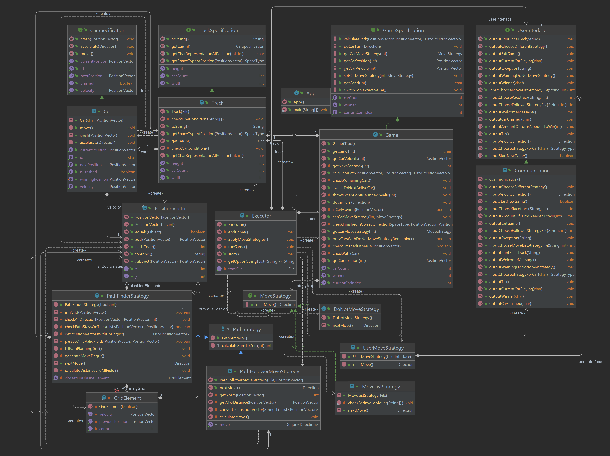
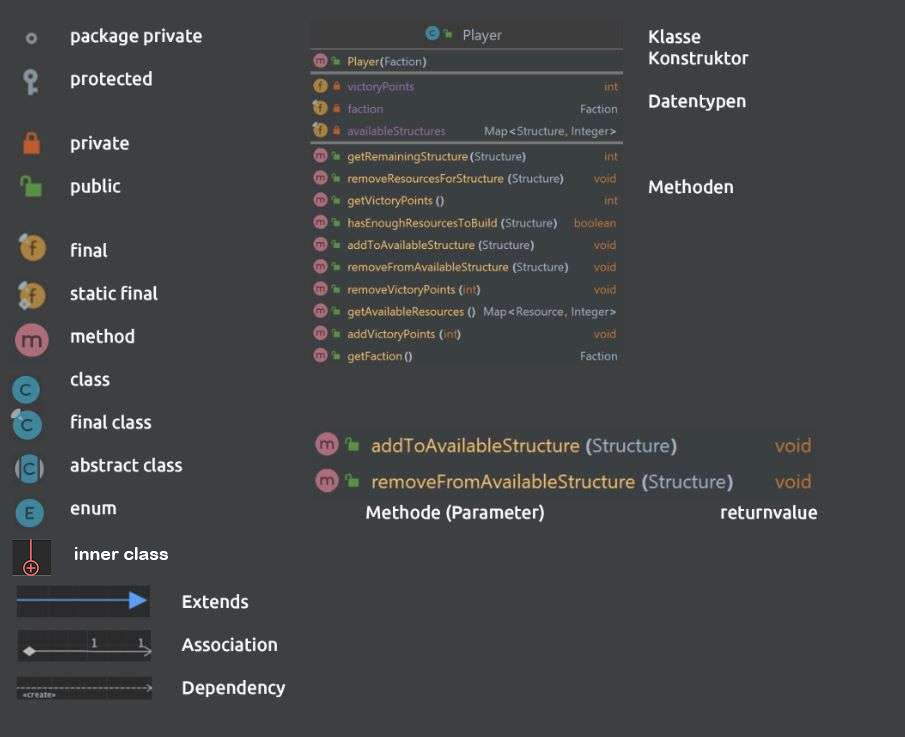

# Project 1: Racetrack

## Overview

This project is a game that lets you race your car through a multitude of different racetracks, steering the car with the help of using velocity vector. To use the racetrack game, first clone the project to your local directory, open the path in console and type in gradlew run which will automatically run the game. After that simply follow the instructions given in the terminal. To win the game, you have to cross the finishing line. If crossed the wrong way round, it counts the laps you take backwards, and you have to make them up by crossing the finishing line the right way the right amount of times.

If a car crashes, others can pass over the crashed car.

The racetrack game was written in Java 17 and is compatible with up to Java 19. To see all the features and commands of the racetrack game, jump to [this section](#commands-and-features).

The project contains various JUnit tests to test the functionality and ensure that the program is working as intended. The JUnit version used in this project is `5.8.1`. The documentation for each test can be read inside the corresponding test class.

The installed gradle version is: 8.0.1.

[Commands and features](#Commands-and-features) •
[Choose your Racetrack](#Choose-your-Racetrack) •
[Choose your move strategy](#Choose-your-move-strategy) •
[Choose a velocity](#Choose-a-velocity) •
[Exit the game](#Exit-the-game) •
[Branch Model](#Branch-Model) •
[Request-Review-Strategy](#Request-Review-Strategy) •
[Class diagram](#Class-diagram)

## Commands and features

### Choose your Racetrack
Once you first start the game, it will let you choose a racetrack. Listed are the available racetrack files. You can choose them by entering the corresponding number.

### Choose your move strategy
After, you need to choose a move strategy for each car participating in the game.
You will be asked separately for each existing car and can choose between the following strategies.

1. DO_NOT_MOVE - the car does not move
2. USER - the car follows the user input
3. MOVE_LIST - the car follows a given list of moves
4. PATH_FOLLOWER - the car follows a given list of coordinates
5. PATH_FINDER - the car finds an optimal path through the track by itself

To choose a strategy simply enter the corresponding number.
If you choose strategy 3, PATH_FOLLOWER, you will also have to choose a challenge point file.

### Choose a velocity
Once the game is up and running you will be asked to enter an acceleration for your next turn.
The accelerations are available as follows and correspond with the numbers on your numpad.

7 = up-left,    8 = up,              9 = up-right
4 = left,       5 = no acceleration, 6 = right
1 = down-left,  2 = down,            3 = down-right

### Exit the game

Once the game is over, you will be asked if you want to start a new game. If answered 'yes', a new game will start. 
If answered 'no', the game and console will close.

Alternatively you can close the game via the red x in the top right corner any time you'd like.

## Branch Model
For each feature, bigger implementation or bugfix there was a separate branch created. Branches were created along the following guidelines:

type of work done / what was done:
types:
- bugfix
- feature
- documentation

rules: branch names in english, lower case letters, spaces replaced with '_' example: bugfix/winpoint_calculation_fixed 

Pull requests are also documented in the Projects Kanban.
https://github.zhaw.ch/PM2-IT22taWIN-muon-pero-pasu/team03-StackOverflow-projekt1-racetrack/projects/1

If an issue has been closed with that pull request, closes #issueNr, can be written in pull request title.

## Request-Review-Strategy
Pull requests were titled with the name of the issue that was worked on including a title starting with PR: so that it would automatically show in our kanban board.
Example: PR: issue #14 implemented feature xy.
Each pull request has to be approved by all the other members of the group before it may be merged into the main branch.

The main branch is protected and can't be directly changed.

## Class diagram

We chose not to display the enums of the given code since they're self-explanatory. If unclear please look at the enum classes in the code.
Custom exceptions are also not shown.

### Class diagram legend

